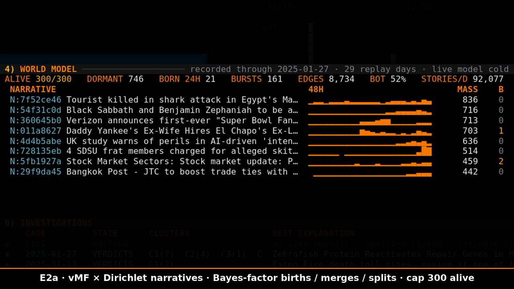
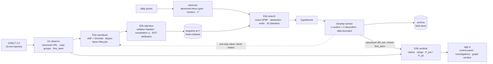

# Yggdrasil

**Market event forensics with a look-ahead fence.** Yggdrasil keeps a deterministic, replayable world model of news attention. When a stock moves abnormally, it searches that model for competing explanations. It then tests each one against evidence retrieved through **SerpApi** and fenced at the moment of the move, and it answers "we do not know" when the evidence doesn't support a story.

SerpApi India Hackathon 2026 · Open Innovation · SerpApi as the evidence sensor · deterministic replay · 86 tests · Python 3.12

[](https://cdn.jsdelivr.net/gh/notPhani/Yggdrasil-Research@af0be399b54fd24cba1580a83eedbf8fbbf3e377/media/yggdrasil-demo.mp4)

**Demo video, 2:43:**
- [Watch in the browser](https://cdn.jsdelivr.net/gh/notPhani/Yggdrasil-Research@af0be399b54fd24cba1580a83eedbf8fbbf3e377/media/yggdrasil-demo.mp4)
- [The file in this repo](media/yggdrasil-demo.mp4)

---

## 1. Problem statement

When a stock breaks, the explanation arrives after the fact. Analysts, news blurbs and search-and-summarize agents all read today's internet, and **today's index already knows what happened**. That makes it easy to explain a move with a story that only became prominent after the price moved.

The question Yggdrasil answers is narrower and testable:

> Which publicly available information, first seen **before** the move (τ*), plausibly explains an abnormal price move? How strong is that explanation compared with "we do not know"?

## 2. Existing approaches

| Approach | What it misses |
|---|---|
| "Why is it moving" news blurbs | Written after the move; no timing provenance for the evidence |
| Event studies | Measure the abnormal return, but don't say which story caused it |
| LLM search-and-summarize agents | Query a live index, so they leak look-ahead; no calibration; rarely abstain |

## 3. Yggdrasil's solution

Each part links to its design document and its code.

- **An always-on world model, replayable bit for bit.** GDELT 2.0 is read in 15-minute windows and turned into narratives and the attention each one gets. The replay is deterministic: state hashes are identical across Python hash seeds, and the replay checkpoints and resumes. Recorded investigations replay with nothing recomputed. [Blueprint](https://notphani.github.io/Yggdrasil-Research/blueprint/) · [`src/ygg/replay.py`](src/ygg/replay.py)
- **Narratives, Engine 2a.** A von Mises–Fisher mixture over MiniLM title embeddings, combined with a Dirichlet entity mixture. Births, merges and splits are closed-form Bayes-factor decisions, with adaptive emergence and a 300-narrative ceiling. [Report](reports/Yggdrasil%20attention%20model%20and%20search.md) · [`src/ygg/narratives/learned.py`](src/ygg/narratives/learned.py)
- **Attention, Engine 2b.** A discrete softplus Hawkes process with divisive competition (ω). Each window's attention is attributed to parent narratives, and the unexplained remainder goes to **BOT**, meaning new information from outside. Those attribution shares are the graph's edges. [Brief](https://notphani.github.io/Yggdrasil-Research/brief/) · [`src/ygg/attention/engine2b.py`](src/ygg/attention/engine2b.py)
- **Observer.** A market-only abnormal-return gate, then clustering by residual correlation. τ* is the first abnormal print. [`src/ygg/observer/trigger.py`](src/ygg/observer/trigger.py)
- **Explanation search, Engine 3a.**
  - An exact node-weighted Steiner tree (DPBF) from BOT to the moved clusters, on the snapshot frozen at τ*.
  - Each edge costs −ln p + 0.3.
  - "We do not know" is always a candidate, and rivals within 20 : 1 are reported.
  - The same search runs on 20 placebo cutoffs to measure how often equally cheap chains appear on quiet days.

  [`src/ygg/search/`](src/ygg/search/)
- **SerpApi evidence and verdicts, Engine 3b.** SerpApi supplies targeted evidence for every hypothesis, fenced at τ* as described in section 4. clingo then enumerates every consistent reading of the evidence and returns four verdict bits for two questions: could this have moved the price (P_pre), and is it true (P_all)? [`src/ygg/verdicts/serpapi.py`](src/ygg/verdicts/serpapi.py) · [`src/ygg/verdicts/engine3b.py`](src/ygg/verdicts/engine3b.py)
- **The terminal product, `ygg ui`.**
  - A live control panel: watchlist, one-minute bars, quote, live GDELT feed, world model and engine status.
  - An investigation workspace with seven tabs: overview, story, evidence, logic, placebo, **SerpApi trace** and audit. Each explanation has a click-through brief.
  - A recorded replay of every investigation.
  - A graph window in the browser, linked live to the terminal.
  - A presenter mode for demos.

## 4. How SerpApi is used

SerpApi is the system's **targeted evidence sensor**. The broad GDELT stream tells Yggdrasil what the world was paying attention to. SerpApi answers a different question: for this hypothesis, what does the open web say, and when did Yggdrasil first see it?

| Step | What happens |
|---|---|
| Queries | Per hypothesis, three Google queries through SerpApi, built from its central subject: **1 confirming and 2 disconfirming**. The disconfirming ones look for what would break the story. |
| Look-ahead fence | Two of the three are date-bounded with `tbs=cdr` to [τ* − 14 d, τ*]. |
| Timing provenance | Each result is joined to Engine 1 by canonical URL. A match **inherits GDELT's first_seen**, and only evidence first seen before τ* can support "this moved the price" (P_pre). Unmatched results support "is it true" (P_all) only. |
| One-way valve | SerpApi results never feed back into the narrative or attention models, so search can't contaminate the world model. |
| Archive and replay | Every response is stored in a content-addressed blob store; no archived file contains the API key (checked). Reruns, replays and the terminal read the archive and spend zero searches. |
| Budget | At most 15 searches per case, best explanation and top rivals first; skipped queries are recorded as such. |
| In the product | The **F6 trace** tab shows every query, its status, its canonical-URL matches and its truth-only results. The **F3 evidence** tab draws the τ* wall through them. |

Measured on the two recorded cases, using the free plan's 250 searches a month:

| Case | Searches sent | Skipped by the cap | Matched an earlier GDELT sighting | Truth only |
|---|---|---|---|---|
| 13 Jan 2025, EIX + PCG | 15 | 9 | 6 | 83 |
| 27 Jan 2025, DeepSeek day | 15 | 2 | 3 | 66 |

That is 30 searches in total, and every rerun since has come from the archive.

## 5. Architecture



The replay runs every engine window by window over GDELT from 30 Dec 2024 to 27 Jan 2025, on a clock that starts 16 Dec. It writes checkpoints every 3 days and snapshots at the windows the cases and placebos need. Investigations and the graph window read only recorded state, so every number on screen traces back to a file. The live parts of the control panel, the GDELT feed and the quotes, are labelled live.

## 6. Results

- **13 Jan 2025, Edison International and PG&E.**
  - Best chain: "Eaton Fire death toll rises" into the EIX + PCG cluster, at **4.2 : 1 against "we do not know"**, with seven rivals within 20 : 1.
  - P_pre and P_all are both SUPPORTED. The verdict hinges on a yahoo.com item ("Investigators probe Eaton Canyon electrical tower area…") first seen **14.5 hours before τ***.
  - Placebos: 20 quiet cutoffs, empirical p = 0.43, false-explanation rate 1.0. The graph cost alone is not diagnostic here, and the dated evidence carries the verdict.
- **27 Jan 2025, DeepSeek-R1.**
  - The trigger fired on 13 instruments in four clusters: chips, power producers, ASM International and Coherent. τ* is 08:00 UTC, the Amsterdam open.
  - The cheapest chain is not credible: a dormant "Pulsar Helium" narrative links to three clusters at p = 0.95.
  - The safeguards hold. Placebo p = 0.33, and both hypotheses are CONSISTENT-BUT-UNPROVEN.
  - A DeepSeek narrative existed from 20 Jan, hours after the R1 release, with 70 DeepSeek-titled articles before τ*. It did not win the cluster links.
- **Known failure, disclosed and not patched after the fact.** The link score adds an unbounded robust z of a narrative's last-day attention to log-lift. A narrative whose earlier attention was near zero has a tiny MAD, so when it revives it can take nearly all the link mass. This is the likely cause on 27 Jan, from reading the code, not yet measured. Bounding the z term is the fix. It was not applied, because it would be tuned on the test case.
- **One open question.** One Jan 27 hypothesis, "What the papers say – December 30", is SUPPORTED, and it has not been examined.

## 7. Run it

```
python3 -m venv .venv && .venv/bin/pip install -e ".[dev]"
.venv/bin/ygg fetch                  # GDELT 2.0 English stream, 2024-12-16 .. 2025-01-31: 13,533 files, 24.6 GB, md5-verified, resumable
.venv/bin/ygg ingest                 # Engine 1: parse, canonical URLs, exact + semantic dedup, clocks, missing-batch flag
.venv/bin/ygg embed-import DIR --release embeddings-minilm-v1   # MiniLM title vectors computed on a GPU (sha256, id order, CPU parity checked)
.venv/bin/ygg replay [--resume]      # deterministic replay of Engines 2a + 2b, window by window, checkpoint every 3 days
.venv/bin/ygg case 2025-01-13        # observer + Engine 3a: clusters, tau*, explanation trees, rivals, abstention, 20 placebos (memoised)
.venv/bin/ygg verdict 2025-01-13     # Engine 3b: hypotheses, SerpApi evidence, claims, clingo verdicts, dossier
.venv/bin/ygg ui [--present steps.json]   # terminal product; graph window at http://127.0.0.1:8765/
.venv/bin/pytest -q                  # 86 tests: determinism, contracts, red-team cases, engines, SerpApi sensor, placebo memo
```

- **SerpApi key.** Set `SERPAPI_API_KEY`, or put the key in `~/.config/serpapi/key`. Without a key every query is recorded as UNAVAILABLE. Adding the key later and rerunning `ygg verdict DAY` fills in the evidence without a replay, because of the one-way valve.
- **Determinism.** Threads are pinned (`OMP_NUM_THREADS=2`). Entity weights are summed in sorted order, so results don't depend on `PYTHONHASHSEED`; this was verified across seeds. Snapshots are hash-chained.
- **Graph window on a remote machine.** Forward the port: `ssh -L 8765:localhost:8765 host`.

## 8. Future development

1. **Live intraday trigger.** Minute bars open cases while the move is happening, and the SerpApi sensor runs within the same window.
2. **A wider SerpApi sensor array.** The Google News engine for fresher targeted retrieval, plus per-source date filters and the source-tier registry applied to search results.
3. **Bounded link score.** Fix the Jan 27 failure with a bounded attention z, evaluated on held-out days with pre-registered placebo targets.
4. **Lean certification of verdicts.** The design is in the blueprint; it was not run in this build.
5. **Larger graphs.** A push-style certificate and Levin tree search for cases beyond 8 terminals, with multilingual GDELT.

## 9. Research and design documents

| Document | What it is |
|---|---|
| [Blueprint](https://notphani.github.io/Yggdrasil-Research/blueprint/) (`blueprint/`) | The final architecture document: every engine's formulas, parameter sensitivity, stability proofs, extreme cases, terminal mockups, build plan, measured facts and sources |
| [Research brief](https://notphani.github.io/Yggdrasil-Research/brief/) (`brief/`) | Key findings, the math, and Manim animations, including a 13-chapter film of the pipeline |
| [Report](reports/Yggdrasil%20attention%20model%20and%20search.md) | The architecture from ingestion to search, written as mathematics, with proofs and a ledger of cited theorems |
| [Research notes](research_notes/) | The six research tracks behind the report |

Claim labels used in the documents:
- **PROVEN:** a cited theorem.
- **DERIVED:** proved in the report.
- **CONJECTURE:** to be tested.
- **MEASURED:** from GDELT 2.0 data.
- **EMPIRICAL:** from the literature.

The documents describe the full design. Section 8 lists what this build does not implement yet.

## Disclosures

- **AI tools.** Claude (Anthropic) was used for design, code and documentation.
- **Open models.**
  - sentence-transformers/all-MiniLM-L6-v2 for narrative embeddings, computed on a local GPU and verified against CPU.
  - minishlab/potion-base-8M for the near-duplicate step.
  - An NLI cross-encoder and GLiNER in the evidence verifier.
- **Data.**
  - GDELT 2.0 (public).
  - The Yahoo chart API, an unofficial endpoint, with responses archived.
  - Wayback Machine snapshots for evidence pages.
  - **SerpApi** for targeted evidence: 30 searches on the free plan, all archived.
- **Not fitted.** These values were chosen, not fitted, and are disclosed:
  - log α = −15 and the entity temperature T = 2 are defaults.
  - κ_s = 250 is supported by the prequential score and the data-implied κ.
  - The adaptive-emergence terms are calibrated on two warmup days.
  - The 300-narrative ceiling enforces the locked capacity.
- **Replay scope.** The replay covers 30 Dec 2024 to 27 Jan 2025; 28 Jan was not replayed. Equity prices are daily bars.
- **Not implemented.** Lean certification and the live intraday trigger.
- **Prior work.** The design and research in `blueprint/`, `brief/`, `reports/` and `research_notes/` came before the build. The code in `src/` was written for this hackathon.

## License

MIT. See `LICENSE`.
